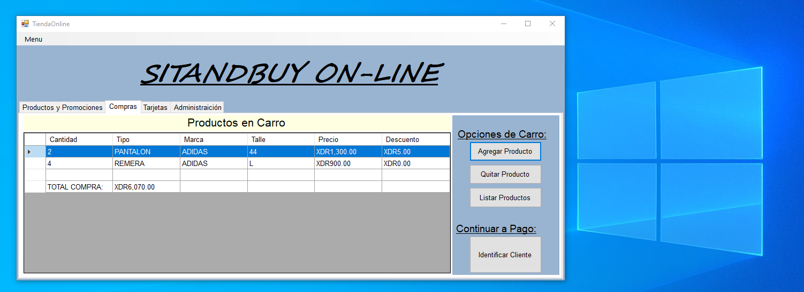
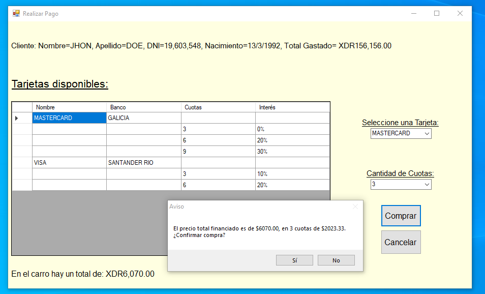

# TIENDA DE DEPORTES

El programa simula una tienda con artículos de deportes. Permite administrar los artículos de deporte creando nuevos o agregando descuentos. El usuario puede agregar productos a un carrito de compras para luego proceder a un panel de pago con algunos métodos de pago pre-definidos. Es posible agregar tarjetas de crédito y/o bonificar la tarjeta con algún descuento.
Los productos, clientes y tarjetas son almacenados en archivos con formato '.csv', los cuales se importan al iniciar la configuración y se pueden sobreescribir la cerrar la app mediante una opción de almacenar cambios.
El programa se desarrolló en Sharp Develop 5.1, se diseñó el motor en consola y luego se incoporó la plataforma de Windows Form para interactuar con el usuario.
Se incluye un archivo '.exe' para ejecutar rápidamente la app.

## Imágenes de referencia
|   |
|-----------------------------------------------------------------------------------------------------------|